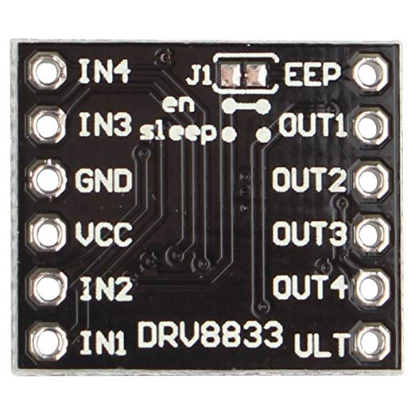
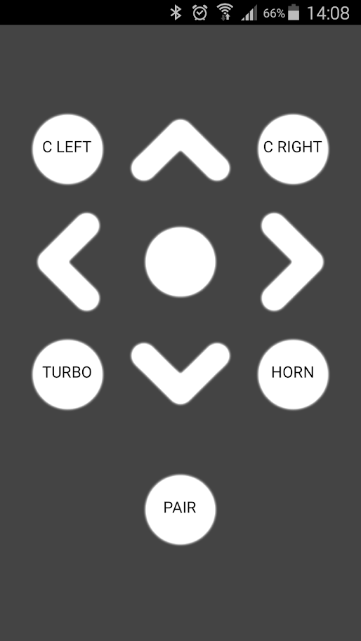

# Description
Control toy tank from any `android` phone with `bluetooth`. Build with `arduino`.
Can be used to all types of tracks, that have 2 `motors`.
# Hardware
###### HC-05 Bluetooth module

###### DRV8833

###### Track

# Branches
###### main
Inproved version that use `drv8833` and works with `bluetooth arduino track`
1. Use `PWM` for speed control
2. Stops motor after move. This approach mean that you have to press move keys constantly.

###### L298N
original code with L298N.
This code sends code on button press and sends `s` code on button release.
It working fine until you loose connection.
# Android application
###### [Bluetooth Arduino Tank Control](https://play.google.com/store/apps/details?id=appinventor.ai_garylcyhk.Tank_Bluetooth_Controller_copy)

###### [Bluetooth Serial Monitor](https://play.google.com/store/apps/details?id=com.giumig.apps.bluetoothserialmonitor)

